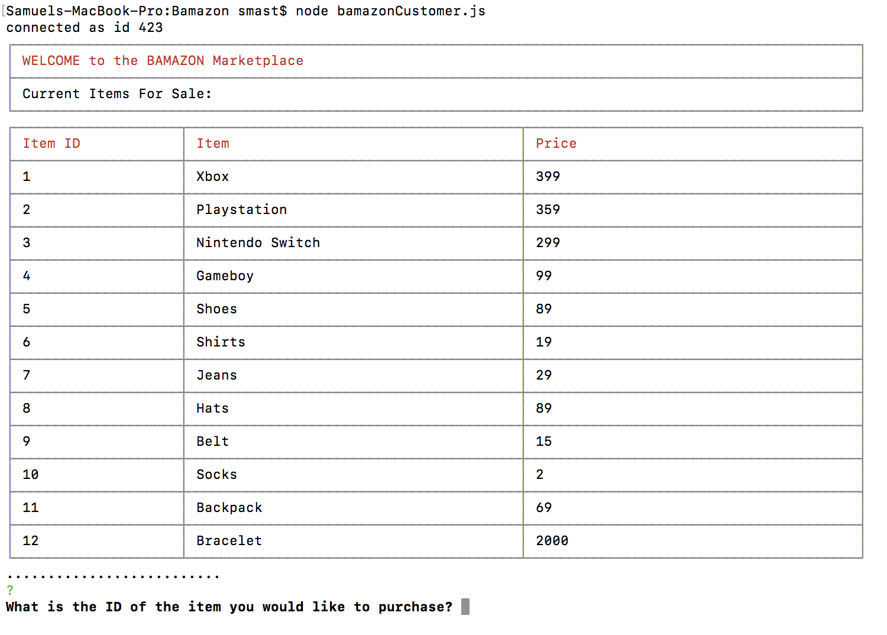
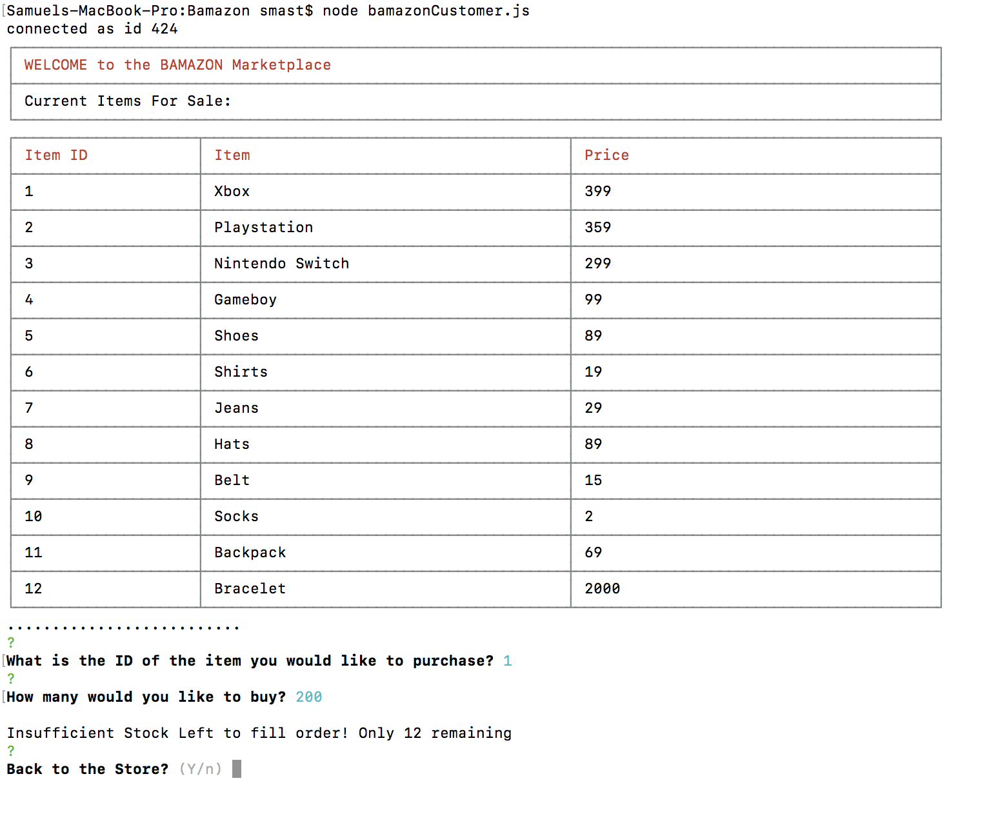
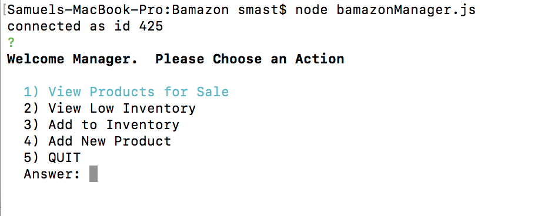
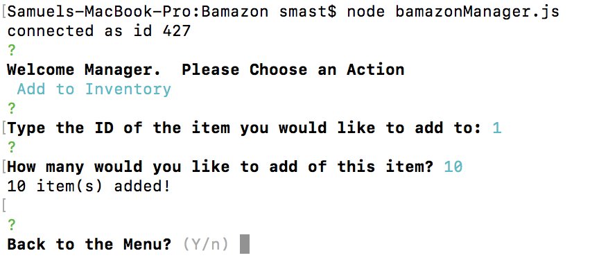
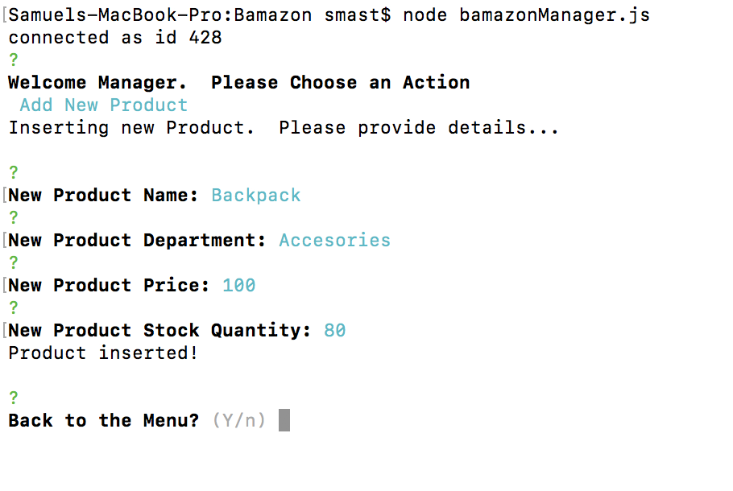
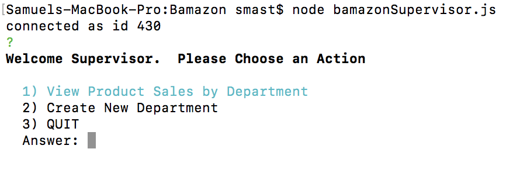
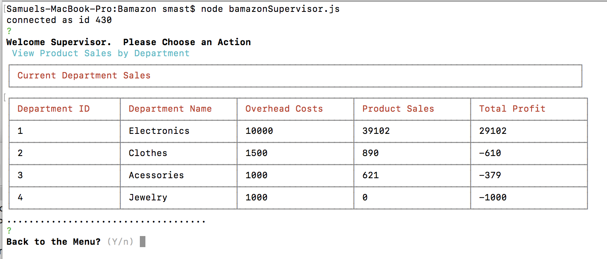
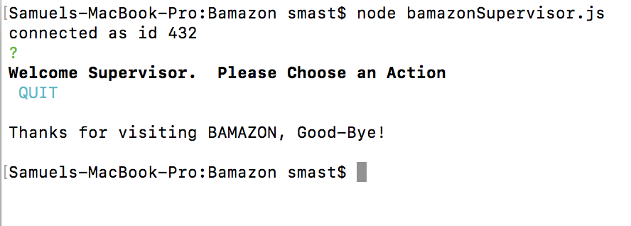

# Bamazon Marketplace

This node.js and mySQL app is a virtual Marketplace that will allow the user different options based on being in Customer, Manager, or SuperVisor mode.


## Getting Started

These instructions will get you a copy of the project up and running on your local machine for development and testing purposes. 


### Prerequisites

The project is included with a package-json file.  Use an npm install to get the necessary packages before running the program.  Once up and running, navigate to the filepath in the terminal to get started.What things you need to install the software and how to install them

```
npm install
```

If the above install is not working for any reason, the 3 required npm packages to install are:

```
npm install inquirer
npm install mySQL
npm install cli-table
```

Once you have these, the next step is to create the initial Database.  Head over to your mySQL profile and use the Seeds file to setup the initial store.  Once these database schemas and seed files are setup, you are ready to start.

### Instructions

Once you are ready, you can head over to your terminal, and enter a command based on how you would like to view the platform.  Here are the 3 options:

* If you would like to enter Bamazon as a customer, enter ```node bamazonCustomer.js```  
* If you would like to enter as a Manager, enter ```node bamazonManager.js```
* If you would like to enter as a Supervisor, enter ```node bamazonSuperVisor.js```

See below for more details on the modes (and Screenshots)

## Modes:

### Customer Mode:

In this mode, you will be able to Buy items from the Bamazon marketplace.  To run this mode, enter:

```node bamazonCustomer.js```

* Once entered, You will see a listing of the store items, their price, and the item ID number.



* When you find an item you would like to purchase, enter its ID number in the prompt.
-You will then be prompted on how many you'd like to buy.

* Once you decide, Bamazon will show you the total and send the item to you (not really)
-You will then be allowed to re-enter the store and make more purchases, or leave for now.  Click enter to stay, or type "N" to leave.


* If you try to buy an item, but there is not enough stock, you will be notified of the current stock.




### Manager Mode

In this mode, you will be able to Manager the items from the Bamazon marketplace.  To run this mode, enter:
```node bamazonManager.js```

* Once entered, You will see a menu.  Chose an Option to get started by typing the number of the option



-"View Products for Sale" will list the total inventory, including item ID, name, price, and current stock


-"View Low Inventory" will list any items with a current stock under 5 items.  THis will allow the manager to monitor the store for items getting too low.


-"Add to Inventory" will allow the Manager to add more stock to any item.  Just enter the Item ID number, and then the quantity of stock you'd ike to add to the inventory, and the BAMAZOn marketplace will add new stock instantly. (If you want to view the updated stock amount go back and select "View Products for Sale")



-"Add New Product" will allow the Manager to add a totally new product.  You will just need to add a Name, Price, and starting Stock Quantity, and the BAMAZON Marketplace will update in real time! (If you want to view your new item, go back and select "View Products for Sale")



-"QUIT" This will shit down the program.


### SuperVisor Mode

In this mode, you will be able to Manager the items from the Bamazon marketplace.  To run this mode, enter:

```node bamazonSupervisor.js```

* Once entered, You will see a menu.  Chose an Option to get started



* "View Products Sales by Department" will list the Department stats, including department ID, department name, total overhead cost, current sales total, and total profit



* "Create New Department" will allow the Supervisor to create new departments to monitor any new items added by the manager.  The supervisor will be asked for the department name, Overhead Cost, and the rest of the data will update automatically if there are items with the same Department in the Marketplace.  (If you would like to view your new Department, you can go back and "View Product Sales by Department")


* "QUIT" This will shit down the program.




## Built With

* Node.js
* MySQL

## Versioning

1.0

## Authors

* **Samuel Mast** - [GitHub](https://github.com/SamMast)


## Acknowledgments

* Denver Coding Bootcamp
